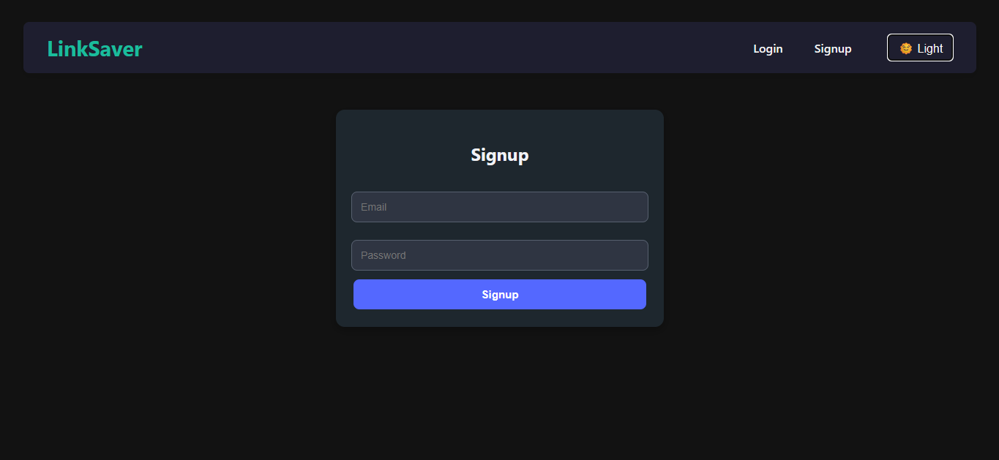
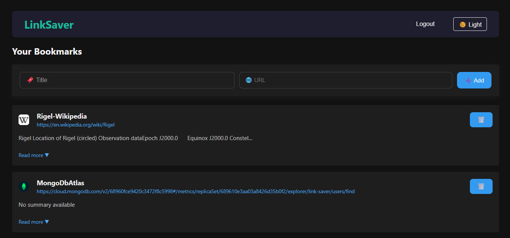
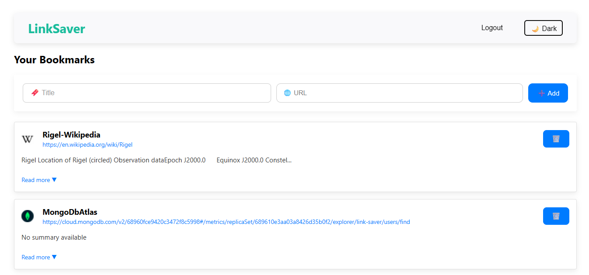
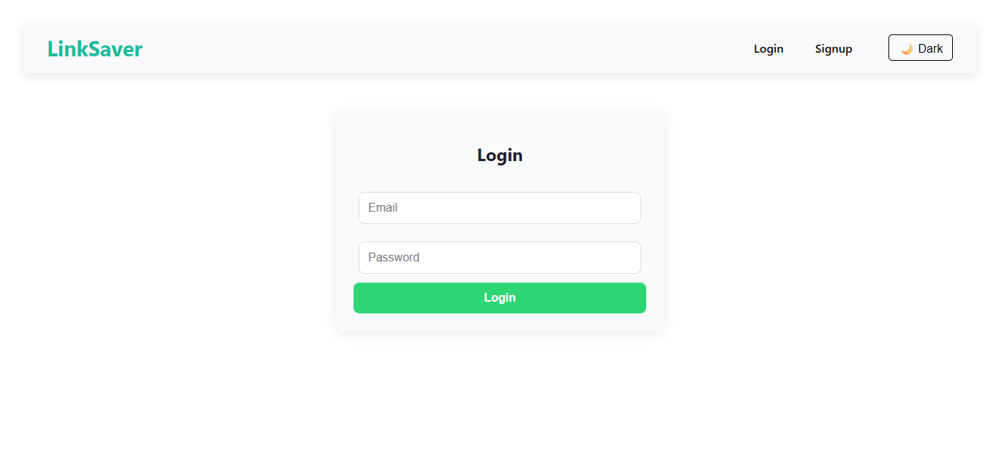

# Link Saver

A full-stack bookmarking app that allows users to save website links with optional summaries, built with React, Node.js, Express, and MongoDB.

---

##  Table of Contents

- [Tech Stack](#-tech-stack)  
- [Screenshots](#-screenshots)  
- [Setup Instructions](#-setup-instructions)  
- [Usage](#-usage)  
- [Time Spent](#-time-spent)  
- [License](#-license)

---

##  Tech Stack

| Layer     | Technologies                                 |
|-----------|----------------------------------------------|
| Frontend  | React, CSS (custom styling), Axios           |
| Backend   | Node.js, Express, MongoDB, Mongoose          |
| Tools     | dotenv, CORS, React Router, Vite (frontend)  |

---

##  Screenshots


<p align="center">
  
  
  
  
</p>

---
## Time Spent

- **Frontend Development:** ~3 hours  
- **Backend Development:** ~5 hours  
- **Database Setup & Integration:** ~30 min  
- **Testing & Debugging:** ~2 hours  
- **Documentation & README:** ~1.5 hour


---

##  Setup Instructions

### Prerequisites

- Node.js (v16+) and npm installed  
- MongoDB Atlas account or local MongoDB setup  

### Backend

```bash
cd backend
cp .env.example .env
# Update .env:
# MONGO_URI=your_mongodb_connection_string
# PORT=5000
npm install
npm run dev
